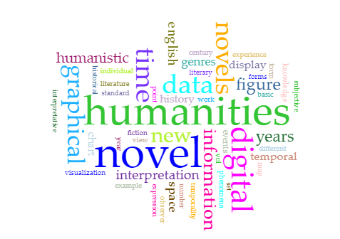

Humanities Approaches to Graphical Display by Johanna Drucker is an extensive article based on the criticism of digital humanists use of graphical displays. She argues that because humanists are taking information and displaying it as statistical items typically found in empirical sciences, that the information displayed acts as a concrete representation of the truth. She states that this way of using visualization is flawed in the discipline of digital humanities because the very foundations of this field are based on the critical analysis and individual interpretation of, for example, texts. She argues that if information and observations in the digital humanities are to be graphically displayed, that they must not conform to empirical standards, but consist purely of a humanistic approach and interpretation. I am inclined to agree with this argument as a fellow digital humanist, that graphic visualization in the field of digital humanities must include information that is approached in a humanistic manner, rather than simply numbers translated onto a graph.

An example of a rigid approach to text analysis and visualization can be seen with the tool Voyant. The tool allows the user to input text and essentially counts the number of times each word is written in the text. The tool then creates both graphs and more creative visuals (the cirrus) to display each terms total, as well as their frequencies in relation to each other. To show how this tool’s output is misleading in terms of humanistic approach, I will compare the frequency of the terms data and capta in Drucker’s article via the cirrus visualization: 

In a cirrus, the size of each term is dependent on the number of times it is mentioned in the analyzed text. As such, the larger the visual of the term, the more times it is mentioned. Upon viewing this cirrus, it is evident that the term data is larger than the term capta. This may mislead a viewer to think that Drucker favors the importance in data over capta, as she mentions it more. What I have gathered from Ramsay’s Reading Machines: Toward an Algorithmic Criticism explains that this digestion of information from Voyant is not interpretation:

If something is known from a word frequency list or a data visualization, it is undoubtedly a function of our desire to make sense of what has been presented. We fill in gaps, make connections backward and forward, explain inconsistencies, resolve contradictions, and, above all, generate additional narratives in the form of declarative realizations…but like a therapy session with ELIZA, they are suffused with the certain knowledge of something crude lying beneath-a bare algorithm that cannot allege anything,

What I understand from Ramsay is that while the user believes they are making their own interpretations of the data presented, but it is nothing more than a reaction to an algorithm. This visualization clearly does not reflect Drucker’s opinion of capta as this concept essentially represents Drucker’s entire argument, where capta would be a more suitable source of information to graphically represent than data would. Visualization tools such as Voyant purely reflect the empirical values associated with text and present it in a way that leads to misleading assumptions, such as the one made above. These tools then do not permit the inclusion of context (other than that applied by the user) and the lack of subjective matter then contradicts the idea that digital humanities is based on the humanistic (subjective) approach to analysis and is driven by technological tools, not consumed by them.
An issue I take up with both Drucker and Ramsay, however, is their lack of feasible solutions to the problems they take issue with. Drucker tries to mock up what visualizations should look like if they took a humanistic approach, but such graphs and visuals are very hard to understand with neither appropriate labelling on any axis, despite them being present, or any adherence to what a graph should contain. The purpose of visualizations like graphs is traditionally to offer quick and digestible information to the reader, but what Drucker has created only adds on confusion for the viewer. Personally, I was only able to decipher Drucker’s graphs after reading the sometimes-extensive subtitles under them, which almost defeats the purpose of the graphics in the first place. On the other hand, this could mark the movement from graphs or tools of empirical information conveyance into something completely different. An issue arises with this, however, that the graphics will only be decipherable by those familiar with the interpretive practice associated with any future advancement in text analysis (essentially only those versed in the digital humanities). As computers and technology are reaching seemingly pseudo-anthropomorphic levels, it is easy to foresee the capability to visualize text in a more humanistic way. For now, though, it seems we are stuck in situation that has many problems but few solutions. 

References
1.	Ramsay, Stephen. “Reading Machines: Toward an Algorithmic Criticism.” UI Press | Stephen Ramsay | Reading Machines: Toward an Algorithmic Criticism, Dec. 2011, www.press.uillinois.edu/books/catalog/75tms2pw9780252036415.html.

2.	Moretti, Franco. Graphs, Maps, Trees. 17 Sept. 2007, www.mat.ucsb.edu/~g.legrady/academic/courses/09w259/Moretti_graphs.pdf.

